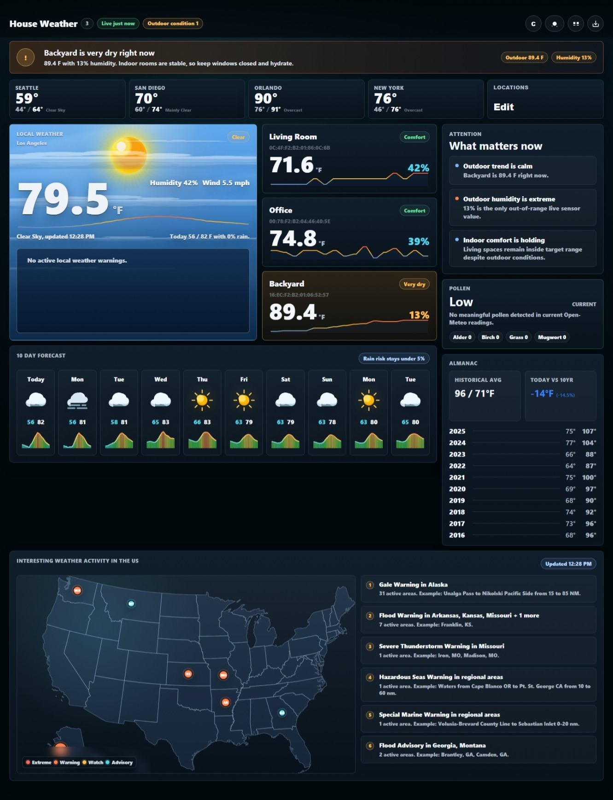

# Govee Dashboard

A local-first dashboard for Govee temperature/humidity sensors with live indoor readings, local weather, active weather alerts, pollen, almanac history, and optional AI-generated insights.

The app is built as a small Flask server plus a static browser UI. It is designed to run well in Docker on a home server, NAS, or desktop.



## Features

- Live Govee sensor readings with history sparklines
- Outdoor/local weather from Open-Meteo
- Active weather warnings from the National Weather Service
- Pollen readings from Open-Meteo Air Quality
- 10-day forecast and selectable comparison cities
- Almanac comparison against historical weather
- Optional AI insights with Anthropic Claude
- Dark/light modes, compact mode, and mobile-friendly layout
- Docker Compose support

## Requirements

- A Govee account with devices supported by the Govee Developer API
- A Govee API key
- Docker and Docker Compose, recommended

Optional:

- Anthropic API key for AI Insights

## Quick Start With Docker

1. Clone the repo:

```powershell
git clone https://github.com/tcullum/govee-dashboard.git
cd govee-dashboard
```

2. Create your local environment file:

```powershell
Copy-Item .env.example .env
```

3. Edit `.env`:

```env
GOVEE_API_KEY=your_govee_api_key_here
PORT=8000
ANTHROPIC_API_KEY=
ANTHROPIC_MODEL=claude-haiku-4-5-20251001
```

`GOVEE_API_KEY` is required for sensor readings. `ANTHROPIC_API_KEY` is optional; leave it blank if you do not want AI insights.

4. Start the dashboard:

```powershell
docker compose up -d --build
```

5. Open:

[http://localhost:8000](http://localhost:8000)

## Running Without Docker

```powershell
python -m venv venv
.\venv\Scripts\Activate.ps1
pip install -r requirements.txt
Copy-Item .env.example .env
python govee_server.py
```

Then open [http://localhost:8000](http://localhost:8000).

On macOS/Linux, activate the virtual environment with:

```bash
source venv/bin/activate
```

## Environment Variables

| Variable | Required | Description |
| --- | --- | --- |
| `GOVEE_API_KEY` | Yes | Govee Developer API key used to read sensor data. |
| `PORT` | No | Flask server port. Defaults to `8000`. |
| `ANTHROPIC_API_KEY` | No | Enables AI insights when set. |
| `ANTHROPIC_MODEL` | No | Anthropic model used for AI insights. |
| `NOAA_TOKEN` | No | Reserved for future/legacy NOAA use. Current weather alerts use public NWS endpoints. |

## Getting A Govee API Key

1. Open the Govee app.
2. Go to account/settings.
3. Find the developer/API key section.
4. Request or copy your API key.
5. Paste it into `.env` as `GOVEE_API_KEY`.

Do not commit `.env`. It is intentionally ignored by Git.

## Useful Commands

Start or rebuild:

```powershell
docker compose up -d --build
```

View logs:

```powershell
docker compose logs --tail=120
```

Stop:

```powershell
docker compose down
```

Check server health/status:

[http://localhost:8000/api/status](http://localhost:8000/api/status)

Force a live readings refresh:

[http://localhost:8000/api/readings?refresh=1](http://localhost:8000/api/readings?refresh=1)

## Data And Caches

The app writes a few local runtime files:

- `govee_readings.csv` for sensor history
- `almanac_cache.json` for historical weather cache
- `insights_cache.json` for AI insight cache

These are ignored by Git so each user keeps their own local data.

## Customizing The Dashboard

Common places to customize:

- City comparison list: `LOCATION_PRESETS` in `app.js`
- Default comparison cities: `DEFAULT_LOCATION_IDS` in `app.js`
- Outdoor sensor detection: `OUTDOOR_KEYWORDS` in `app.js`
- Weather/almanac fallback location: search for `36.17` and `-115.14`
- Visual styling and weather scene animation: `style.css`

The local weather panel asks the browser for geolocation when available. If geolocation is blocked or unavailable, it falls back to Las Vegas.

## API Endpoints

| Endpoint | Purpose |
| --- | --- |
| `/api/readings` | Current Govee readings, cached briefly for fast UI refresh. |
| `/api/readings?refresh=1` | Force a fresh Govee API poll. |
| `/api/history` | Sensor history read from `govee_readings.csv`. |
| `/api/almanac` | Historical weather averages from Open-Meteo Archive. |
| `/api/almanac/insights` | Optional AI insights. Requires `ANTHROPIC_API_KEY`. |
| `/api/status` | Cache, refresh, and AI status. |

## Troubleshooting

If no sensors appear:

- Confirm `GOVEE_API_KEY` is set in `.env`.
- Run `docker compose logs --tail=120`.
- Open `/api/readings?refresh=1` and check for returned errors.
- Confirm your devices are visible to the Govee Developer API.

If AI insights fail:

- Set `ANTHROPIC_API_KEY`.
- Confirm `ANTHROPIC_MODEL` is available for your Anthropic account.
- Check `/api/status` and Docker logs.

If weather warnings look wrong:

- Allow browser location access, or update the fallback coordinates in `app.js`.
- Weather alerts are provided by the National Weather Service and are US-focused.

## Security Notes

- Keep `.env` private.
- Do not expose the dashboard publicly unless you understand the risks.
- If you publish it through a tunnel or reverse proxy, consider adding authentication at the proxy layer.

## License

MIT License. See [LICENSE](LICENSE).
